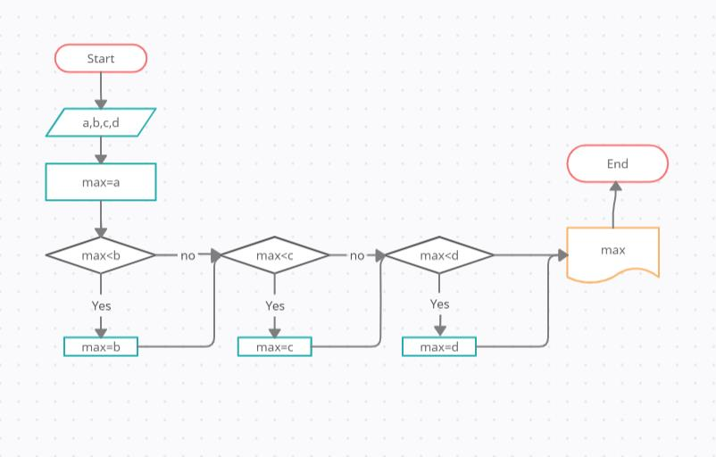

# Задание 1. 
* нарисовать блок-схему алгоритма
* снабдить репозиторий оформленным текстовым описанием решения
* написать программу решающую поставленную задачу.

## Блок- схема нахождения максимального числа

1. Начало. 
2. Задаём пременные.
3. Пременную "а" Принимаем за "max".
4. Выполняем условие: Если переменная "max" меньше "b", тогда выполняется следующее условие, если больше, тогда переменная "b" становится "max".
5. Выполняем условие: Если переменная "max" меньше "с", тогда выполняется следующее условие, если больше, тогда переменная "с" становится "max".
6. Выполняем условие: Если переменная "max" меньше "d", тогда выполняется следующее условие, если больше, тогда переменная "d" становится "max".
7. Выводим ответ на экран.